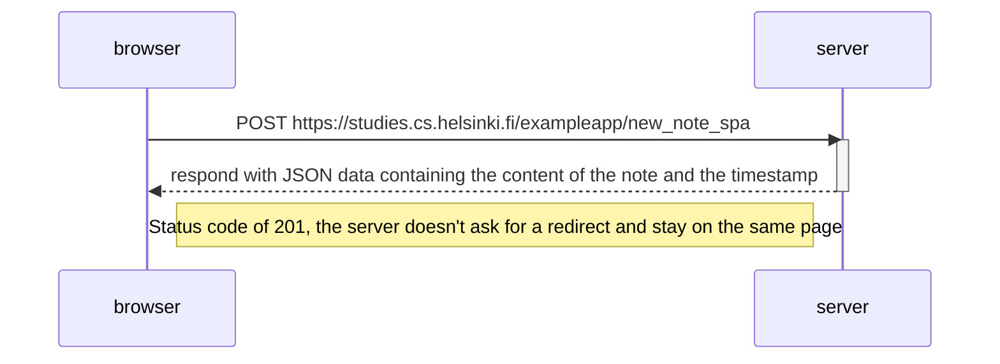

```mermaid
    sequenceDiagram
    participant browser
    participant server

    browser->>server: POST https://studies.cs.helsinki.fi/exampleapp/new_note_spa
    activate server
    server-->>browser: respond with JSON data containing the content of the note and the timestamp
    deactivate server

    Note right of browser: Status code of 201, the server doesn't ask for a redirect and stay on the same page
```